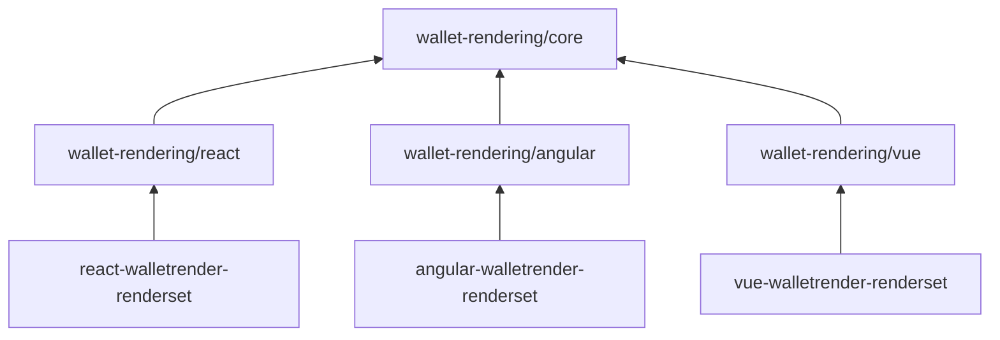
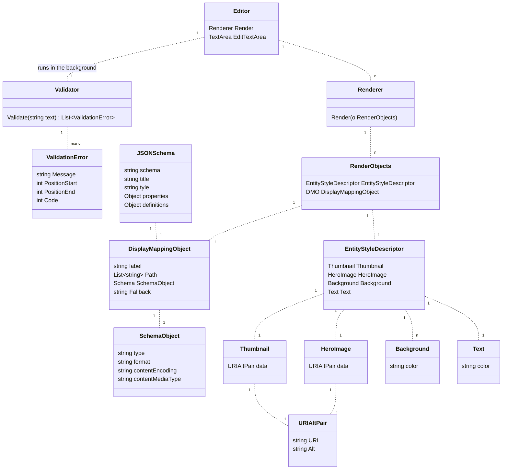

# Architecture

## High Level Architecture

```mermaid
graph BT
    WalletRenderingCore[wallet-rendering/core]
    React[wallet-rendering/react]
    Angular[wallet-rendering/angular]
    Vue[wallet-rendering/vue]

    React --> WalletRenderingCore
    Angular --> WalletRenderingCore
    Vue --> WalletRenderingCore

    VueRenderSet[vue-walletrender-renderset] --> Vue
    AngularRenderSet[angular-walletrender-renderset] --> Angular
    ReactRenderSet[react-walletrender-renderset] --> React
```

## Internal Models

This is currently in progress.

```mermaid
classDiagram

    class Editor {
        Renderer Render
        TextArea EditTextArea
    }

    class Renderer {
        Render(o RenderObjects)
    }

    class Validator {
        Validate(string text) List~ValidationError~
    }

    class ValidationError {
        string Message
        int PositionStart
        int PositionEnd
        int Code
    }

    class RenderObjects {
        EntityStyleDescriptor EntityStyleDescriptor
        DMO DisplayMappingObject
    }

    class DisplayMappingObject {
        string label
        List~string~ Path
        Schema SchemaObject
        string Fallback
    }

    class JSONSchema {
        string schema
        string title
        string tyle
        Object properties
        Object definitions
    }

    class SchemaObject {
        string type
        string format
        string contentEncoding
        string contentMediaType
    }

    class EntityStyleDescriptor {
        Thumbnail Thumbnail
        HeroImage HeroImage
        Background Background
        Text Text
    }
    class Thumbnail {
        URIAltPair data
    }

    class HeroImage {
        URIAltPair data
    }

    class Background {
        string color
    }

    class Text {
        string color
    }

    class URIAltPair {
        string URI
        string Alt
    }


    RenderObjects "1" .. "1" EntityStyleDescriptor
    EntityStyleDescriptor "1" .. "n" Background
    EntityStyleDescriptor "1" .. "1" HeroImage
    EntityStyleDescriptor "1" .. "1" Thumbnail
    EntityStyleDescriptor "1" .. "1" Text

    Thumbnail "1" ..  "1" URIAltPair
    HeroImage "1" ..  "1" URIAltPair
    DisplayMappingObject "1" .. "1" SchemaObject
    JSONSchema "1" .. "1" DisplayMappingObject
    RenderObjects "1" .. "1" DisplayMappingObject
    Editor "1" .. "n" Renderer
    Renderer "1" .. "n" RenderObjects
    Editor "1" .. "1" Validator : runs in the background
    Validator "1" .. "many" ValidationError
```
