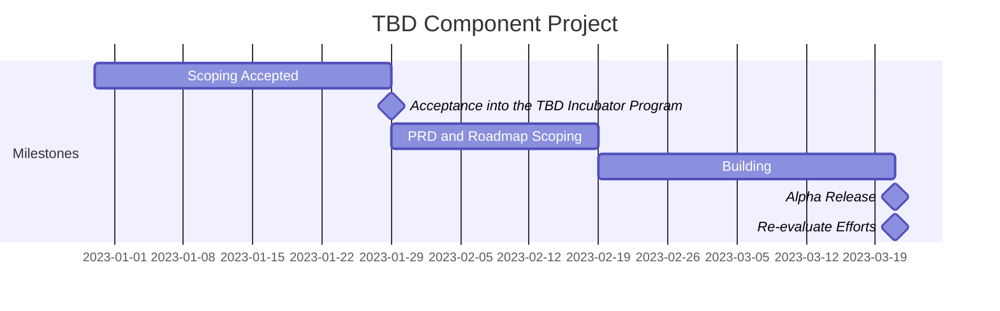
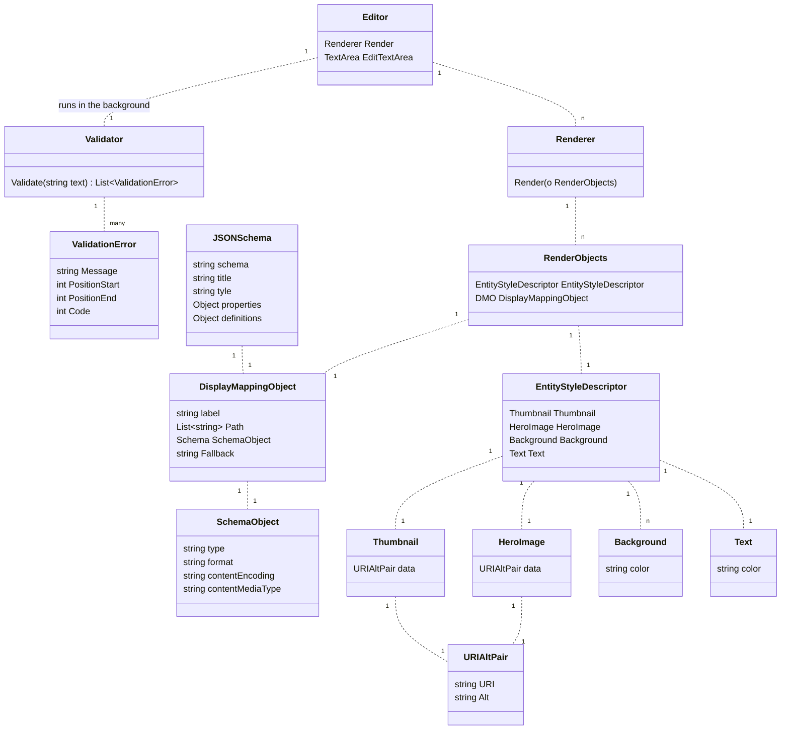

# TBD Incubator Proposal 1c -- Display editor easing visual presentation of VCs, conforming to Wallet Rendering spec

[](https://hackmd.io/PCWVlYqsQhu8dLuoyKt_UA)

<!-- markdown-toc start - Don't edit this section. Run M-x markdown-toc-refresh-toc -->

**Table of Contents**

- [TBD Incubator Proposal 1c -- Display editor easing visual presentation of VCs, conforming to Wallet Rendering spec](#tbd-incubator-proposal-1c----display-editor-easing-visual-presentation-of-vcs-conforming-to-wallet-rendering-spec)
- [Summary](#summary)
- [Current Status](#current-status)
- [Points of Contact](#points-of-contact)
- [Mission and Scope](#mission-and-scope)
- [Project Lifecycle](#project-lifecycle)
- [Milestones](#milestones)
- [Context](#context)
- [Definitions](#definitions)
- [Target Users](#target-users)
- [Diagrams](#diagrams)
- [Architecture](#architecture)
- [Success Critieria](#success-critieria)
- [Constraints and Considerations](#constraints-and-considerations)
- [Design Goals](#design-goals)
- [Resource Constraints](#resource-constraints)
- [User Stories](#user-stories)
- [Areas of Risk](#areas-of-risk)
- [Testing](#testing)
- [Code Monitoring](#code-monitoring)
- [Metrics](#metrics)
- [Engineering Metrics](#engineering-metrics)
- [Product Metrics](#product-metrics)
- [Appendix](#appendix)

<!-- markdown-toc end -->

## Summary

The following Product Requirements document describes the TBD Incubator Program requested by Benri Corporation, which we codename "Project Aibo (相棒)" in the spirit that we give all our projects a name to operate under. Aibo is the word for partner in japanese, and Benri would like to help accelerate TBD's Web5 efforts.

This collaborative synergy with TBD will harness the power of Open Source and help with the widespread adoption of web 5.

## Current Status

The current state is : **PROPOSAL**. Major changes to the status of this document are accepted.

**Version Tag:** 0.0.1-SM

## Points of Contact

This describes the main roles w.r.t to the project.

| Name            | Email           | Role                   |
| --------------- | --------------- | ---------------------- |
| Andor Kesselman | andor@benri.io  | Technical Lead         |
| Reuben Bailon   | reuben@benri.io | UX and Business        |
| Dan Buchner     |                 | TBD's POC for Benri    |
| ALR             |                 | Incubator Program Lead |

## Mission and Scope

The mission of this project is to help with the edification and adoption of web 5/SSI standards and with the Wallet Rendering specifications.

As Benri is a small organization with limited resources, the scope of this particular project is to build a display editor easing visual presentation of VCs, conforming to Wallet Rendering spec.

## Project Lifecycle

The following describes the phases of the project.

0. **TBD/Benri Open Source Incubator Alignment:** Benri invited into Open Source
   incubation program.
1. **Scoping and Planning:** Detailed PRD finalized.
2. **Initial Implementation:** Building the initial implementation (initial repo
   open or closed source? ) 4 weeks.
3. **Initial Release|Alpha: v1.0** If closed, open at this point
4. **Maintainence and Expansion:** Decide with TBD about maintence and expansion
   efforts

After scoping and planning, Benri intends to give 4 weeks to the project. We
will of course, also maintain the project, etc where required.

## Milestones

- [ ] Acceptance into the TBD Incubator Program
- [ ] Alpha PRD Designed
- [ ] Building
- [ ] Alpha release
- [ ] Effort re-evaluation



## Context

[Discussion here](https://forums.tbd.website/t/incubator-proposal-shared-js-components/214/5)

## Definitions

- [Verifiable Credential](https://www.w3.org/TR/vc-data-model/): Credentials
  are a part of our daily lives; driver's licenses are used to assert that we are
  capable of operating a motor vehicle, university degrees can be used to assert
  our level of education, and government-issued passports enable us to travel
  between countries. This specification provides a mechanism to express these
  sorts of credentials on the Web in a way that is cryptographically secure,
  privacy respecting, and machine-verifiable.
- Widget: an application, or a component of an interface, that enables a user to
  perform a function or access a service.
- library: a collection of software functions and software packages made
  generally available, with an intent on being reused across applications
- [Wallet rendering](https://identity.foundation/wallet-rendering/) : A DIF specification. Styling the visual presentation of various entities types and data (e.g. credentials) is a common need that runs across many different use cases. In order to provide a predictable set of styling and data display hints to User Agents, Issuers, Verifiers, and other participants who render UI associated with entities and data, this specification endeavors to standardize a common data model to describe generic style and data display hints that can be used across any formulation of UI elements.

## Target Users

- developers
- TBD
- Benri

## Diagrams

**Sample 1**

**Sample 2**


## Architecture



## Success Critieria

1. 1 npm compliant library for reusable web5 components
   - done in vanilla js/typescript to ensure reusability in different frameworks
     (vue, react, etc.)
2. A UI with two views:
   - An editor view
   - An render view

## Constraints and Considerations

- Try to not use frameworks (i.e Vue and Javascript)
- Should be able to be extended easily
- Accepts that the WR specs may be able to change over time. Loosely coupled to the current specifications to function.

### Design Goals

- Simple
- Re-usable
- Composability
- Extendable
- Customizable

### Resource Constraints

- Benri is a small startup. We have limited resources so need to scope this
  right. We will probably hire someone to help with these efforts.

## User Stories

- As a developer, I want to be able to render a VC using the wallet rendering specs.
- As a developer, I want to modify and see how a render of a VC changes on the
  fly. I want to use this as a tool to learn how edit my own Verifiable Credentials.

## Areas of Risk

- Making sure we can use things cross builds.
- Duplication of efforts

## Testing

Testing harnesses TBD later in scoping, but most likely the following two ways:

1. CICD with Github Actions
2. Test Suite (Jest/Yarn) etc.

## Code Monitoring

We will probably have the following CICD services running on the repo.

- FOSSA checks
- CodeCov ( are minimum coverage metrics required for this project? )
- Possily some embedded contributor metrics on the README

## Metrics

These metrics will be used to evaluate the progress of the repository.

### Engineering Metrics

1. \# of supported components
2. \# of commits
3. \# of contributors
4. \# of prs
5. average commit size
6. code coverage

### Product Metrics

1. \# of github stars
2. \# of downloads over npm

## Appendix

[Identity Foundation](https://identity.foundation/wallet-rendering/#abstract)

**Entity Style**

```json
{
  "$schema": "http://json-schema.org/draft-07/schema#",
  "title": "Entity Styles",
  "type": "object",
  "definitions": {
    "image": {
      "type": "object",
      "properties": {
        "uri": {
          "type": "string",
          "format": "uri"
        },
        "alt": {
          "type": "string"
        }
      },
      "required": ["uri", "alt"]
    },
    "color": {
      "type": "object",
      "properties": {
        "color": {
          "type": "string",
          "pattern": "^#([A-Fa-f0-9]{6}|[A-Fa-f0-9]{3})$"
        }
      },
      "required": ["color"]
    }
  },
  "properties": {
    "thumbnail": {
      "$ref": "#/definitions/image"
    },
    "hero": {
      "$ref": "#/definitions/image"
    },
    "background": {
      "$ref": "#/definitions/color"
    },
    "text": {
      "$ref": "#/definitions/color"
    }
  }
}
```

**Path**

```json
{
  "path": ["$.name", "$.vc.name"],
  "schema": {
    "type": "string"
  },
  "fallback": "Washington State Driver License"
}
```

**Label Display with Mapping Object**

```json
{
  "label": "License Name",
  "path": ["$.name", "$.vc.name"],
  "schema": {
    "type": "string"
  },
  "fallback": "Washington State Driver License"
}
```

**Display Mapping Object**

```json
{
  "$schema": "http://json-schema.org/draft-07/schema#",
  "title": "Display Mapping Object",
  "oneOf": [
    {
      "type": "object",
      "additionalProperties": false,
      "properties": {
        "path": {
          "type": "array",
          "items": { "type": "string" }
        },
        "schema": {
          "oneOf": [
            {
              "type": "object",
              "additionalProperties": false,
              "properties": {
                "type": {
                  "type": "string",
                  "enum": ["boolean", "number", "integer"]
                }
              },
              "required": ["type"]
            },
            {
              "anyOf": [
                {
                  "type": "object",
                  "additionalProperties": false,
                  "properties": {
                    "type": {
                      "type": "string",
                      "enum": ["string"]
                    },
                    "format": {
                      "type": "string",
                      "enum": [
                        "date-time",
                        "time",
                        "date",
                        "email",
                        "idn-email",
                        "hostname",
                        "idn-hostname",
                        "ipv4",
                        "ipv6",
                        "uri",
                        "uri-reference",
                        "iri",
                        "iri-reference"
                      ]
                    }
                  },
                  "required": ["type"]
                },
                {
                  "type": "object",
                  "additionalProperties": false,
                  "properties": {
                    "type": {
                      "type": "string",
                      "enum": ["string"]
                    },
                    "contentEncoding": {
                      "type": "string",
                      "enum": [
                        "7bit",
                        "8bit",
                        "binary",
                        "quoted-printable",
                        "base16",
                        "base32",
                        "base64"
                      ]
                    },
                    "contentMediaType": {
                      "type": "string"
                    }
                  },
                  "required": ["type"]
                }
              ]
            }
          ]
        },
        "fallback": {
          "type": "string"
        }
      },
      "required": ["path", "schema"]
    },
    {
      "type": "object",
      "additionalProperties": false,
      "properties": {
        "text": {
          "type": "string"
        }
      },
      "required": ["text"]
    }
  ]
}
```

**Labelled Display Mapping Object**

```json
{
  "$schema": "http://json-schema.org/draft-07/schema#",
  "title": "Labeled Display Mapping Object",
  "oneOf": [
    {
      "type": "object",
      "additionalProperties": false,
      "properties": {
        "path": {
          "type": "array",
          "items": { "type": "string" }
        },
        "schema": {
          "oneOf": [
            {
              "type": "object",
              "additionalProperties": false,
              "properties": {
                "type": {
                  "type": "string",
                  "enum": ["boolean", "number", "integer"]
                }
              },
              "required": ["type"]
            },
            {
              "anyOf": [
                {
                  "type": "object",
                  "additionalProperties": false,
                  "properties": {
                    "type": {
                      "type": "string",
                      "enum": ["string"]
                    },
                    "format": {
                      "type": "string",
                      "enum": [
                        "date-time",
                        "time",
                        "date",
                        "email",
                        "idn-email",
                        "hostname",
                        "idn-hostname",
                        "ipv4",
                        "ipv6",
                        "uri",
                        "uri-reference",
                        "iri",
                        "iri-reference"
                      ]
                    }
                  },
                  "required": ["type"]
                },
                {
                  "type": "object",
                  "additionalProperties": false,
                  "properties": {
                    "type": {
                      "type": "string",
                      "enum": ["string"]
                    },
                    "contentEncoding": {
                      "type": "string",
                      "enum": [
                        "7bit",
                        "8bit",
                        "binary",
                        "quoted-printable",
                        "base16",
                        "base32",
                        "base64"
                      ]
                    },
                    "contentMediaType": {
                      "type": "string"
                    }
                  },
                  "required": ["type"]
                }
              ]
            }
          ]
        },
        "fallback": {
          "type": "string"
        },
        "label": {
          "type": "string"
        }
      },
      "required": ["path", "schema", "label"]
    },
    {
      "type": "object",
      "additionalProperties": false,
      "properties": {
        "text": {
          "type": "string"
        },
        "label": {
          "type": "string"
        }
      },
      "required": ["text", "label"]
    }
  ]
}
```
