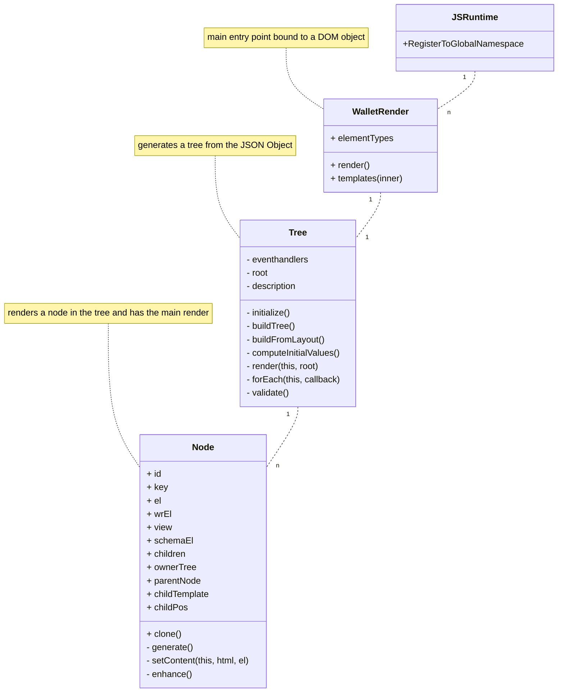

# Wallet Rendering Library

# Wallet Rendering.js File

In the wrender.js file, you bind a DOM element to the Render object. The
following process then takes place.

1. The JSON is parse, and converted into a Tree
2. Each node in the tree generates an HTML element
3. These are then bound to event handlers if necessary
4. The DOM is then updated

Here's a class diagram for review.

